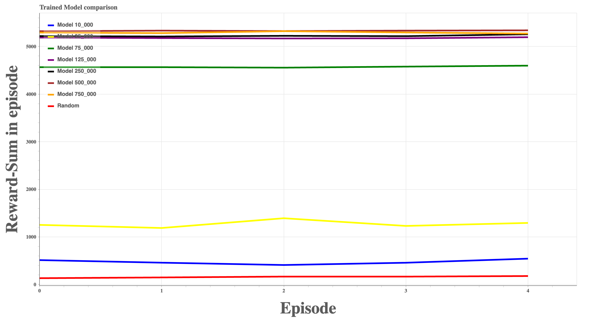

<h3 align="center">MicroGrid OpenAI Environment</h3>
<h5 align="center">Project made  in the Reinforcement Learning Course WS 21 University Hanover</h5>
<div align="center">

[](/LICENSE)

</div>

---
<div>
<p align="center"> Reinforcement Learning Environment, in which an agent has to distribute electricity in a village in such a way that as little energy as possible has to be imported in order to save costs and greenhouse gases.
    <br> 
</p>
</div>

# 📝 Table of Contents

- [About](#about)
- [Getting Started](#getting_started)
- [Usage](#usage)
- [Coding Conventions](#coding_conventions)
- [Authors](#authors)
- [Acknowledgements](#acknowledgements)
- [Citations](#citations)

# 🧐 About <a name = "about"></a>

Final Project for the Reinforcement Learning course by Marius Lindauer during the WS 21 at the Leibniz University Hanover. Goal of the Project is to develop a custom openai Gym environment that can help prevent climate change.

In the project, both an environment was modelled and an agent was developed. The fictitious village contains buildings of different sizes. There are buildings that provide energy through photovoltaic or wind power plants as well as consume energy, and there are properties that only consume energy. The energy consumption of buildings depends on the number of inhabitants. All plots are connected to each other via a micro electricity grid. When a building's energy needs are not met, energy is purchased from an external lignite-fired power plant, but it is expensive and unecologically sourced. The energy production of buildings depends on the season, weather conditions, time of day and nominal power of the energy sources. The environment simulates the fictitious village in a random year between 2001 and 2021 at a latitude and longitude that can be specified. The agent is to distribute the electrical energy hourly in such a way that the village has to import as little energy as possible from the lignite-fired power plant.

# 🏁 Getting Started <a name = "getting_started"></a>

After installation the environment can be used as a normal openai gym environment:

```python
  import gym
  micro_grid:micro-v2
  env = gym.make("micro_grid:micro-v2")
  #Train an agent
```

## Installing

__To use this Environment Python 3.8.10 is needed__
Newer Python Versions may work but are not tested/supported.

This Project depends on pytorch to train agents so before running it install your prefered version of <a href="https://pytorch.org/get-started/locally/"> pytorch</a>

Afterwards install the rest of the requirements using:

```console
pip install -r requirements.txt
```

To install this environment clone this repository onto your local machine.
Then change your command line directory to the top level folder of this repository and register the environment with 

```console
pip install -e micro-grid
```

# 🎈 Usage <a name="usage"></a>

## Train your own Agent/Algorithm

To train your own agent on this environment you can use the normal openai gym way of creating and training environments.

```python
  import gym
  micro_grid:micro-v2
  env = gym.make("micro_grid:micro-v2")
  #Train an agent
```

There are 4 different versions of this environment however using either the minimal version or version 2 is recommended.
As version 0 and version 1 are deprecated.
The id's of the different versions are

```
micro_grid:micro-v0 # deprecated
micro_grid:micro-v1 # deprecated
micro_grid:micro-v2
micro_grid:micro_minimal-v0 # minimal_working_version
```

The minimal version is a static environment. While version 2 contains random elements.

### Rendering the environment

This environment can be rendered via matplotlib when using version 2, altough this feature is experimental it should still work.
Here is an example of how to render a already trained model:

```python
from stable_baselines3 import *
import gym

  micro_grid:micro-v2
  eval_env = gym.make("micro_grid:micro-v2")
  model = PPO.load("./trained_models/PPO_micro_test")

  while True:
        action, _ = model.predict(obs)
        obs, reward, done, info = eval_env.step(action) 
        eval_env.render()
        if done == True:
            break
```
The rendered Enviromnet looks like this:
<br>


The circle size represents the number of inhabitants. The labels on the arrows show the chosen action. The color of circles show if energy was bought for this house (green no, red yes). The color depth of the arrows represents the amount of energy sent. The imported energy in the legend is in amount of money spent on it.

### Modifying the environment

The building constellation of version 2 of our environment can be modified by changing the config.yml.
The config follows the basic yaml rules and a config with one building that has both available energy sources looks like this: 

```yml
buildings:
  - energy_sources:
    - type: solar
      peak_power: 11.1 #in kWp
    - type: wind
      peak_power: 10.1 #in kWp
    battery:
      capacity: 27.76 #in kWh
    inhabitants: 5
```

A building may contain as many energy sources as you wish, but it has only one battery.
To see the standard configuration for the environment look into the [_config.yml_](config.yml) of this repository.

For changing the building constellation of the minimal version adjust the buildings list in [_Grid_env_minimal.py_](./micro-grid/micro_grid/envs/Grid_env_minimal.py)

## Training and using a PPO agent

We allow you to train a simple PPO agent for version 2 of the environment from the command line via the _[ExecuteBaseline](ExecuteBaseline.py)_ Python script.

### Let us train an agent for you

To train and save an agent simply use the following command:

```console
python ExecuteBaseline.py [model_save_path(without .zip)] -x
```

### Evaluate an already trained agent

To load and evaluate an already trained agent use this command instead:

```console
python ExecuteBaseline.py [model_load_path(without .zip)] -l
```

### Pretrained Agents

This Project comes with a few [Pretrained PPO Agents](./trained_models/) for version 2 of the environment. They Perform better than a random policy. Since the main goal of this project is to develop an environment it is possible to achieve even higher results. The models were trained with a random seed of 42 and evaluated on the seed 96.
The Agents were trained for a different amount of timesteps each, with parameters and other info concerning training that can be found in the [Report](REPORT.md). 
The Agents were evaluated for 5 Episodes with the following results, the last value is for comparison to random.

| Model   | Mean Reward per Step  | STD |
| ------- | ---                   | --- |
| 10,000  | 0.054                 |0.963|
| 25,000  | 0.145                 |0.951|
| 75,000  | 0.522                 |0.836|
| 125,000 | 0.591                 |0.790|
| 250,000 | 0.596                 |0.785|
| 500,000 | 0.608                 |0.775|
| 750,000 | 0.604                 |0.779|
| Random  | 0.018                 |0.960|

Here is a plot comparing the episodic reward sum:


A interactive Versions comparing the different episode rewards of all models can be found [here](./Plotter/Plotter.html) and the evaluation data for the different models can be found [here](./trained_csv/).
__Further details regarding the training setup and reward function etc. can be found in the [Report](REPORT.md)__

### All options

If you want to know what else you can do with the script here is the help output:

```console
usage: python ExecuteBaseline.py

positional arguments:
  filename              Sets the path where the model should be stored or loaded.

optional arguments:
  -h, --help            show this help message and exit
  -l, --load            If this argument is set the program loads an model and does not train a new one.
  -r, --render          [EXPERIMENTAL] Renders the model actions in the environment with mathplotlib.
  -x, --exit            Exits after trainig model if set.
  -s EVAL_SEED, --eval_seed EVAL_SEED
                        Seed for the evaluation environment.
  -t TIMESTEPS, --timesteps TIMESTEPS
                        Specifies the maximum timesteps for training of model. Default 50_000.
  --log LOG             Specifies the path where the reward log should be saved. Default no logs will be saved.
  -e EPISODES, --episodes EPISODES
                        Sets the amount of evaluation episodes. Default: 1.
  --no_random           Does not evaluate random. Default evaluates random.
```

# :hot_pepper: Coding Conventions <a name = "coding_conventions"></a>

This project adheres to the [pep8](https://www.python.org/dev/peps/pep-0008/) coding conventions.

# ✍️ Authors <a name = "authors"></a>

- [@Scrabbone](https://github.com/Scrabbone) 🧙‍♂️
- [@SupaaSchnitzel](https://github.com/SupaaSchnitzel) 🥩

# 🎉 Acknowledgements <a name = "acknowledgements"></a>

- [OpenAi Gym](https://gym.openai.com) - Environment framework
- [Stabel Baseline 3](https://stable-baselines3.readthedocs.io/en/master/index.html) Used to train Agents
- [Meteostat](https://dev.meteostat.net) Used to fetch relevant weather data
- [PySolar](https://pysolar.readthedocs.io/en/latest/) Used to computate the suns radiation
- [Numpy](https://numpy.org) Used for array operations
- [pandas](https://pandas.pydata.org) Used to save and read .csv
- [matplotlib](https://matplotlib.org/stable/index.html) Used to render the environment 
- [pytzwhere](https://github.com/pegler/pytzwhere) Used for timezone calculations
- [PyYAML](https://pyyaml.org/) Used for the config
- [bokeh](https://bokeh.org/) Used for plotting
  
#  Citations <a name = "citations"></a>

- [DESTATIS](https://www.destatis.de/DE/Themen/Gesellschaft-Umwelt/Umwelt/UGR/private-haushalte/Tabellen/stromverbrauch-haushalte.html;jsessionid=2FFEB6666E1BE3F554FA4DD5163A1F87.live711#fussnote-1-133562) Energy COnsumption based on household size
- [DESTATIS](https://www.destatis.de/DE/Themen/Wirtschaft/Preise/Erdgas-Strom-DurchschnittsPreise/_inhalt.html) Energy Prices
- [Duvignau et al.](https://research.chalmers.se/publication/518289/file/518289_Fulltext.pdf) Energy Production rates big/small homes and battery sizes
- [Tech for Future](https://www.tech-for-future.de/co2-kwh-strom/) Co2 in gram per kWh
